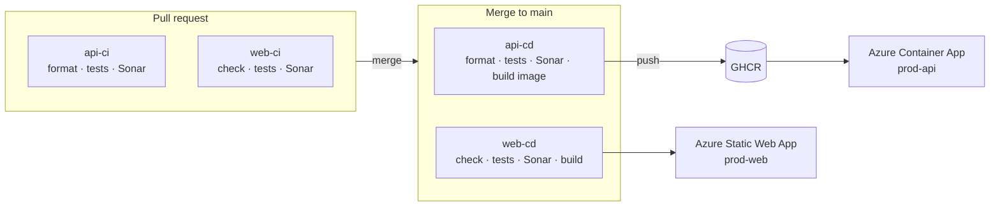

# Monorepo

Explore and validate a .NET + React monorepo foundation — repo structure, CI/CD, and GitHub conventions — using ASP.NET Core, Vite, and TanStack Router.

## Highlights

- Credential-less deploys — Azure login via OIDC, no cloud secrets stored in GitHub
- Quality gate — SonarCloud blocks merge on coverage, bugs, and vulnerabilities, not just formatting
- Path-filtered CI — each PR builds and tests only the app that actually changed
- Supply-chain hardening — every GitHub Action pinned to a commit SHA, container images deployed by immutable digest

## Apps

- [`apps/api`](apps/api) — ASP.NET Core, deployed to Azure Container Apps ([live](https://ca-monorepo-api-prod-brs.gentlecliff-429b9963.brazilsouth.azurecontainerapps.io/))
- [`apps/web`](apps/web) — Vite + React + TanStack Router, deployed to Azure Static Web Apps ([live](https://gray-field-0d74a620f.7.azurestaticapps.net/))

## Pipeline

## Docs

- [`docs/adr/`](docs/adr) — architecture decisions
- [`docs/infra/`](docs/infra) — Azure infra setup (shared resources + per-app steps)
